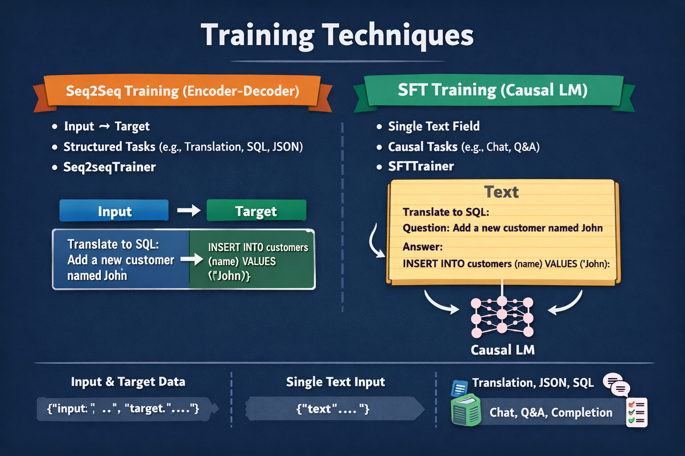
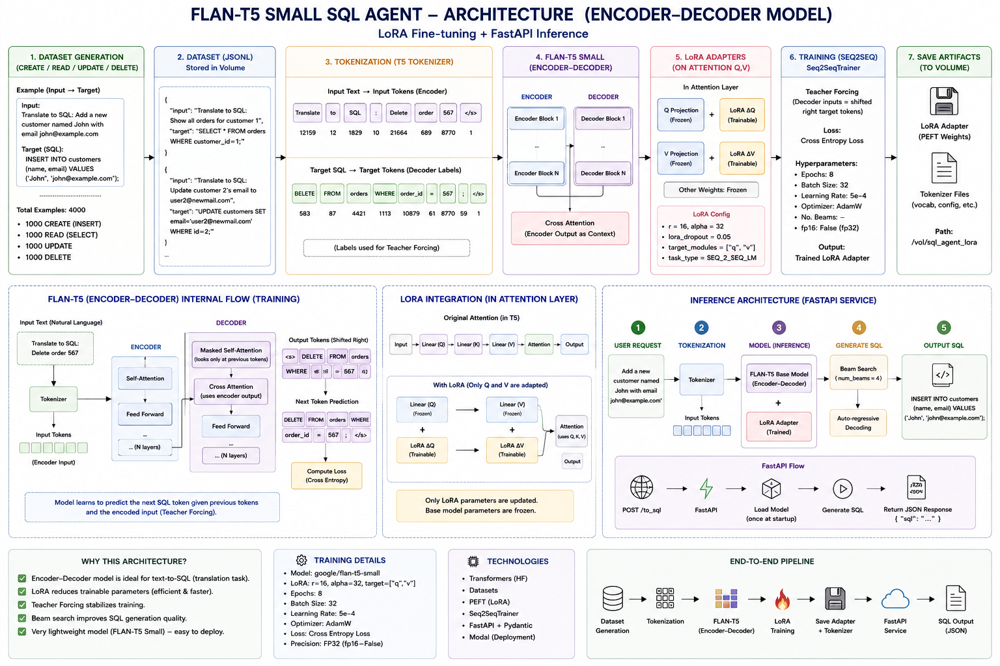
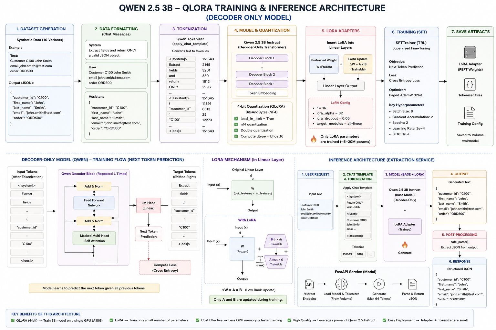

# Hybrid AI Training Platform

This repository demonstrates practical fine-tuning patterns for three major transformer architectures:

| Architecture | Model | Use Case |
|--------------|--------|----------|
| Encoder | DistilBERT | Intent Classification |
| Encoder-Decoder | FLAN-T5 | Text-to-SQL |
| Decoder-Only | Qwen 2.5 | Information Extraction |

## Why This Repository?

Many engineers learn how to call LLM APIs but never understand:

- How encoder models are trained
- How sequence-to-sequence models work
- How decoder-only LLMs are fine-tuned
- When to use LoRA vs QLoRA

This repository provides working examples for all three.
## Model Types

## Training Technique


## Architecture


## Encoder Training (DistilBERT)


### Use Cases

- Intent Classification
- Text Classification
- Document Categorization

## Encoder-Decoder Training (FLAN-T5)



### Use Cases

- Text-to-SQL
- Translation
- Summarization

## Decoder Only Training (Qwen)



### Use Cases

- Information Extraction
- Chat Applications
- JSON Generation

## Technologies

- Hugging Face
- PEFT
- LoRA
- QLoRA
- TRL
- Modal
- FastAPI
## Source Code

### Encoder Model - DistilBERT Intent Classification

- [modal_app_hybrid.py](https://github.com/CPattanayak/hybrid-flan-service/blob/main/modal_app_hybrid.py)

### Encoder-Decoder Model - FLAN-T5 Text-to-SQL

- [sql_agent.py](https://github.com/CPattanayak/hybrid-flan-service/blob/main/sql_agent.py)

### Decoder-Only Model - Qwen 2.5 Information Extraction

- [ext_agent.py](https://github.com/CPattanayak/hybrid-flan-service/blob/main/ext_agent.py)

---

## Training

```bash
modal run modal_app_hybrid.py
modal run ext_agent.py
modal run sql_agent.py
```

## Author

Chandan Pattanayak

Senior Principal Engineer 