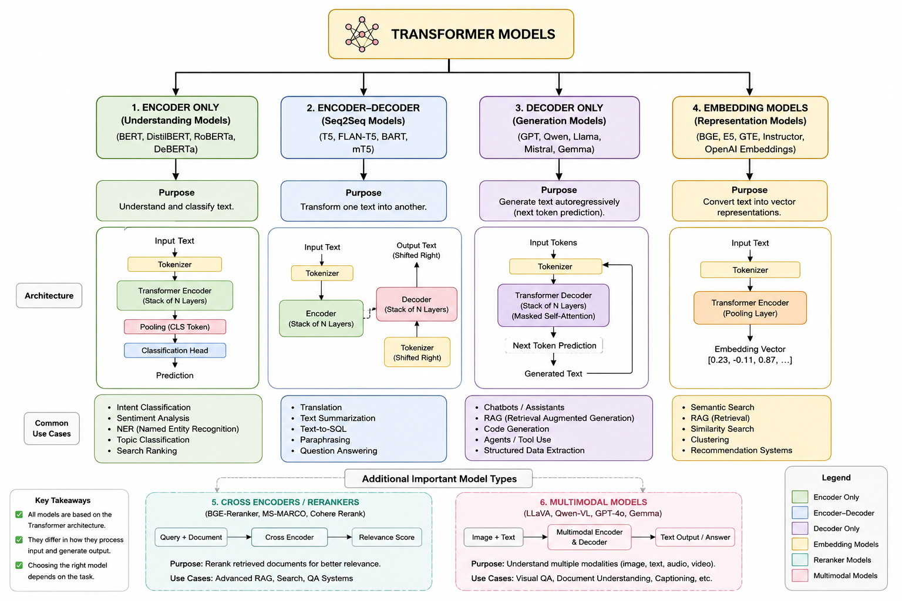
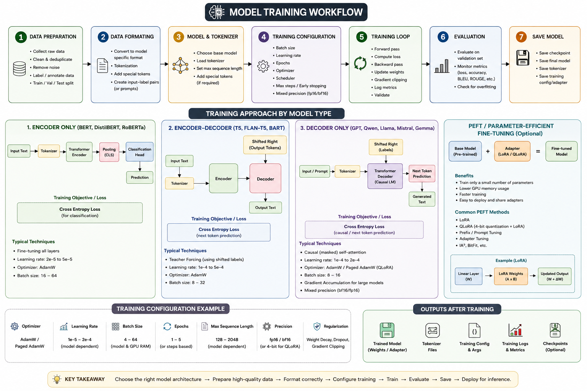
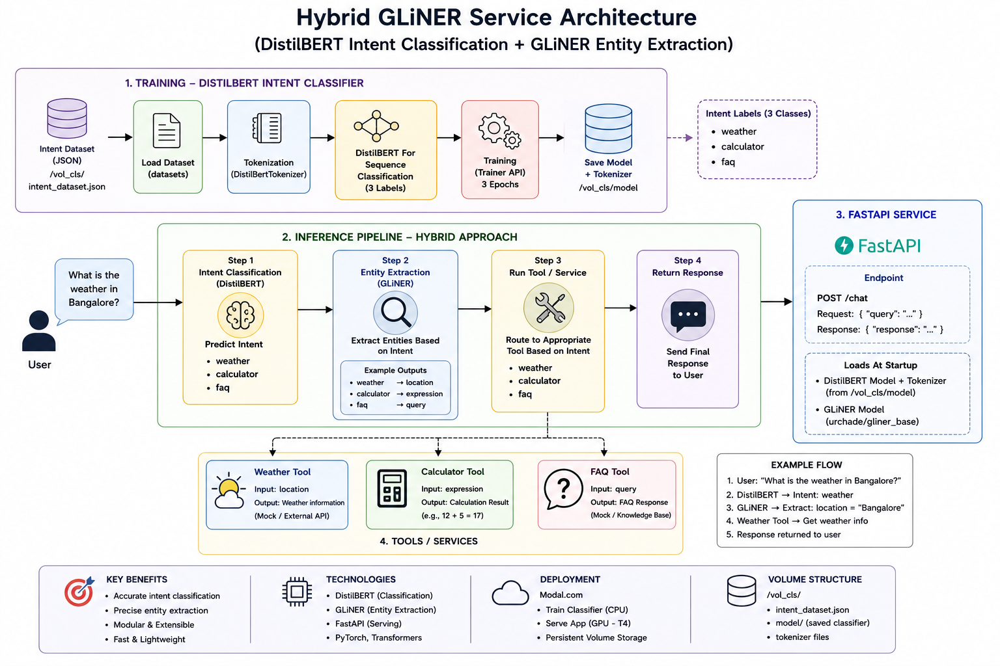

# Hybrid AI Training Platform

A practical implementation of multiple AI model training architectures using Hugging Face, LoRA, QLoRA, Modal, and FastAPI.

This repository demonstrates how different transformer architectures are trained and deployed for real-world applications such as Intent Classification, Text-to-SQL Generation, and Information Extraction.


---

## Architecture Overview




| Architecture | Model | Use Case |
|-------------|---------|----------|
| Encoder | DistilBERT | Intent Classification |
| Encoder-Decoder | FLAN-T5 | Text-to-SQL Generation |
| Decoder Only | Qwen 2.5 | Information Extraction |

---

## Encoder Model - Intent Classification
### Architecture


### Model
- DistilBERT
- Hugging Face Trainer

### Training Flow

```text
Input Text
    ↓
Tokenization
    ↓
DistilBERT Encoder
    ↓
Classification Head
    ↓
Intent Prediction
```

### Source Code

- [modal_app_hybrid.py](https://github.com/CPattanayak/hybrid-flan-service/blob/main/modal_app_hybrid.py)

---

## Encoder-Decoder Model - Text to SQL

### Architecture


### Model
- FLAN-T5
- LoRA Fine Tuning
- Seq2SeqTrainer

### Training Flow

```text
Natural Language
        ↓
     Encoder
        ↓
Context Representation
        ↓
     Decoder
        ↓
     SQL Query
```

### Source Code

- [ext_agent.py](https://github.com/CPattanayak/hybrid-flan-service/blob/main/ext_agent.py)

---

## Decoder Only Model - Information Extraction
### Architecture


### Model
- Qwen 2.5 3B Instruct
- QLoRA
- SFTTrainer

### Training Flow

```text
Prompt
   ↓
Qwen Decoder
   ↓
LoRA Adapters
   ↓
Generated JSON
```

### Source Code

- [sql_agent.py](https://github.com/CPattanayak/hybrid-flan-service/blob/main/sql_agent.py)

---

## Technology Stack

### AI / ML

- Hugging Face Transformers
- Datasets
- PEFT
- LoRA
- QLoRA
- TRL
- BitsAndBytes

### Deployment

- Modal
- FastAPI
- Uvicorn

### Language

- Python

